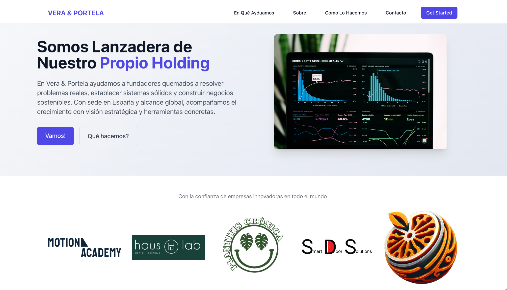
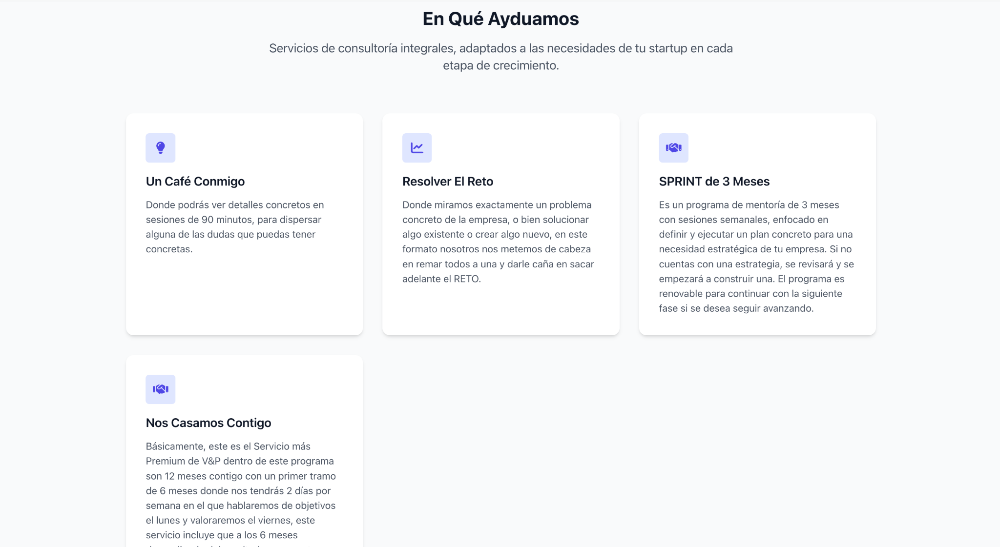
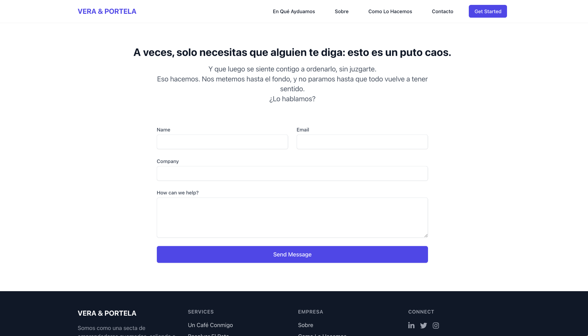

# Vera & Portela — Startup Consulting Website Showcase

A bilingual (Spanish/English) consulting website designed for Vera & Portela, a boutique advisory firm based in Spain. The website presents their services, philosophy, and case studies for founders and startups at different stages of growth.

🟣 **Live site:** [https://veraportela.es](https://veraportela.es)

---

## 🚀 About Vera & Portela

Vera & Portela helps startup founders solve real business problems, build systems, and scale sustainable ventures. With roots in Spain and a global mindset, they work side-by-side with clients through strategic frameworks, sprint mentoring, and founder-aligned solutions.

---

## 🧩 Key Features

### 🔹 Hero Section: Brand Identity & Mission

- Strong brand tone with gradient aesthetics.
- Hooks users with a clear mission: “Lanzadera de Nuestro Propio Holding.”
- Immediate CTAs: **¡Vamos!** and **¿Qué hacemos?**

---

### 🔹 Services Section: Structured Offerings

- Modular service cards under **En Qué Ayudamos**:
  - ☕ _Un Café Conmigo_
  - 🧠 _Resolver El Reto_
  - 📆 _SPRINT de 3 Meses_
  - 💍 _Nos Casamos Contigo_
- Each service is tailored to a specific startup lifecycle stage.

---

### 🔹 Contact & Call-to-Action

- Bold CTA language: “Esto es un puto caos.”
- Contact form includes name, company, email, and a free-text field.
- Designed to invite authentic conversations, not just sales leads.

---

## 🛠️ Technical Stack

- **Frontend:** React with Tailwind CSS
- **Hosting:** Previously deployed via Hugging Face Spaces / Heroku
- **Design:** Mobile-friendly, branded visuals, modern layout
- **Assets:** Custom illustrations and branded UI elements

---

## ✉️ Contact

For access to backend/private repo, design system, or to build something similar, reach out:

📧 `joey@dksmithandco.com`

---

## 📁 Assets

Place all image assets in a folder named `assets/` at the root of your repository:

| File Name            | Description                        |
|----------------------|------------------------------------|
| `hero_vera.png`      | Hero section screenshot            |
| `services_vera.png`  | Services section screenshot        |
| `contact_vera.png`   | Contact section screenshot         |

---

## 🧭 License

This showcase is for portfolio/demonstration purposes only. Content is owned by Vera & Portela and may not be reused commercially without permission.
